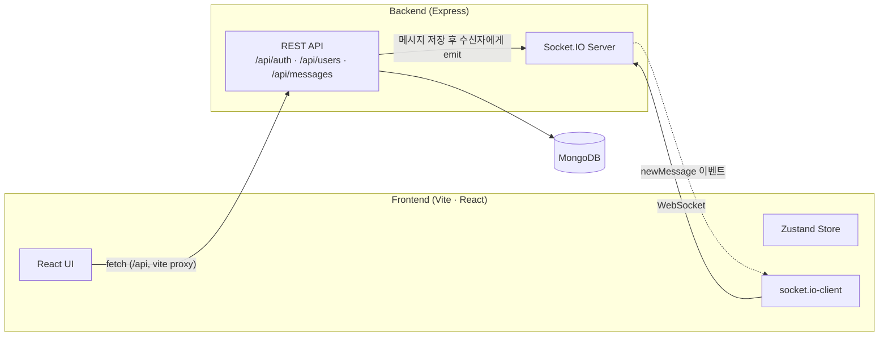

# 💬 ChatApp — MERN 실시간 채팅 웹앱

MERN(MongoDB · Express · React · Node.js) 스택과 **Socket.IO**를 기반으로 구현한 1:1 실시간 채팅 애플리케이션입니다.
JWT 기반 인증, 실시간 메시지 송수신, 접속 상태 표시 등 메신저의 핵심 기능을 담았습니다.

> 학습용으로 시작해 코드 리뷰·리팩토링을 거쳐 구조와 타입 안정성을 다듬은 프로젝트입니다.

<br />

## ✨ 주요 기능

- **회원가입 / 로그인 / 로그아웃** — bcrypt 비밀번호 해싱, JWT(HttpOnly 쿠키) 인증
- **실시간 1:1 채팅** — Socket.IO로 메시지를 즉시 상대방에게 전달
- **접속 상태 표시** — 현재 온라인인 사용자를 사이드바에 실시간 반영
- **새 메시지 알림** — 도착 시 사운드 재생 + 말풍선 흔들림 애니메이션
- **대화 상대 검색** — 이름 기반 검색으로 빠른 대화 시작
- **자동 프로필 이미지** — 성별에 따라 기본 아바타 자동 지정
- **반응형 UI** — Tailwind CSS · daisyUI 기반의 깔끔한 화면

<br />

## 🛠 기술 스택

| 구분 | 기술 |
| --- | --- |
| **Frontend** | React 19, TypeScript, Vite, Zustand, React Router, Tailwind CSS, daisyUI, react-hot-toast |
| **Backend** | Node.js, Express 5, Mongoose, Socket.IO |
| **Database** | MongoDB |
| **Auth** | JWT, bcryptjs, HttpOnly Cookie |
| **실시간 통신** | Socket.IO (WebSocket) |

<br />

## 🏗 시스템 아키텍처



- **REST API**는 인증·유저 조회·메시지 CRUD를 담당하고, 개발 환경에서는 Vite 프록시(`/api` → `localhost:8000`)로 동일 출처처럼 호출합니다.
- **메시지 흐름**: 발신자가 `POST /api/messages/send/:id` → 서버가 DB 저장 후 수신자의 socket으로 `newMessage` 이벤트 emit → 수신자 화면에 즉시 반영.
- **접속 상태**: 소켓 연결/해제 시 서버가 `userId → socketId` 맵을 갱신하고 전체에 `getOnlineUsers`를 브로드캐스트합니다.

<br />

## 📁 폴더 구조

```
.
├── backend/
│   ├── controllers/      # 요청 처리 로직 (auth · message · user)
│   ├── db/               # MongoDB 연결
│   ├── middlewares/      # JWT 인증 검사 (checkAuth)
│   ├── models/           # Mongoose 스키마 (User · Message · Conversation)
│   ├── routes/           # API 라우트 정의
│   ├── utils/            # 토큰 발급, Socket.IO 설정
│   └── server.js         # 서버 진입점
│
└── frontend/
    └── src/
        ├── components/   # 화면 단위 컴포넌트 (messages · sidebar · ...)
        ├── context/      # Auth · Socket Context
        ├── hooks/        # 데이터 페칭/액션 커스텀 훅
        ├── pages/        # 라우트 페이지 (home · login · signUp)
        ├── types/        # 공용 타입 정의
        ├── utils/        # apiClient 래퍼, 시간 포맷 등
        └── zustand/      # 전역 상태 (대화 목록 · 메시지)
```

<br />

## 🚀 실행 방법

### 사전 요구사항

- **Node.js** — LTS(현재 v24) 사용을 권장합니다. 저장소 루트에 `.nvmrc`가 있어 `nvm`을 쓴다면 아래처럼 맞출 수 있습니다.
  ```bash
  nvm use      # .nvmrc(24) 기준으로 전환 (미설치 시: nvm install)
  ```
  > Vite 8은 Node `>= 20.19` 또는 `>= 22.12`를 요구합니다.
- **MongoDB** (로컬 설치 또는 MongoDB Atlas)

### 1. 저장소 클론 & 의존성 설치

```bash
git clone <repository-url>
cd MERN-fullstack-chat-app

# 백엔드 의존성 (루트)
npm install

# 프론트엔드 의존성
cd frontend && npm install && cd ..
```

### 2. 환경 변수 설정

`.env.example`을 복사해 값을 채웁니다.

```bash
# 백엔드
cp backend/.env.example backend/.env

# 프론트엔드 (선택 — 기본값으로도 동작)
cp frontend/.env.example frontend/.env
```

| 변수 | 위치 | 설명 |
| --- | --- | --- |
| `PORT` | backend | 서버 포트 (기본 8000) |
| `MONGO_DB_URI` | backend | MongoDB 연결 문자열 |
| `JWT_SECRET` | backend | JWT 서명 비밀 키 |
| `NODE_ENV` | backend | `production`일 때 쿠키 `secure` 활성화 |
| `CLIENT_URL` | backend | Socket.IO CORS 허용 origin (예: `http://localhost:3000`) |
| `VITE_SOCKET_URL` | frontend | Socket 서버 주소 (기본 `http://localhost:8000`) |

> **백엔드 env 로딩 방식**: 백엔드는 `backend/loadEnv.js`에서 파일 위치 기준 절대 경로로 `backend/.env`를 읽습니다.
> 덕분에 서버를 어디서 실행하든(루트에서 `npm run server` 등 `process.cwd()`와 무관하게) 항상 `backend/.env`를 불러오므로, 백엔드 환경 변수는 **반드시 `backend/.env`** 에 둡니다. (프론트엔드 env는 Vite 규칙에 따라 `frontend/.env`)

### 3. 실행

터미널 두 개에서 각각 실행합니다.

```bash
# ① 백엔드 (루트에서)
npm run server      # nodemon 개발 모드

# ② 프론트엔드 (frontend/에서)
cd frontend
npm run dev         # http://localhost:3000
```

브라우저에서 `http://localhost:3000` 접속 후 회원가입하여 사용합니다.
(채팅을 테스트하려면 서로 다른 두 계정으로 로그인하세요. 시크릿 창을 활용하면 편합니다.)

<br />

## 📡 API 개요

모든 응답은 `{ result, data?, message? }` 형태로 통일되어 있습니다.

| Method | Endpoint | 설명 | 인증 |
| --- | --- | --- | --- |
| `POST` | `/api/auth/signup` | 회원가입 | — |
| `POST` | `/api/auth/login` | 로그인 | — |
| `POST` | `/api/auth/logout` | 로그아웃 | — |
| `GET` | `/api/users` | 대화 상대 목록 조회 | ✅ |
| `GET` | `/api/messages/:id` | 특정 상대와의 메시지 조회 | ✅ |
| `POST` | `/api/messages/send/:id` | 메시지 전송 | ✅ |

> Socket 이벤트: `getOnlineUsers`(접속자 목록 브로드캐스트), `newMessage`(새 메시지 수신)

<br />

## 🔍 리팩토링하며 신경 쓴 점

- **인증 버그 수정** — 로그인은 `accessToken` 쿠키를 발급하는데 로그아웃은 다른 이름(`jwt`)을 지워 실제로 로그아웃되지 않던 문제를 수정.
- **API 응답 형태 통일** — 엔드포인트마다 제각각이던 응답 키를 `{ result, data, message }`로 표준화하고, 공통 `apiClient` 래퍼로 fetch·에러 처리를 일원화.
- **불필요한 네트워크 요청 제거** — 사이드바 대화 목록을 두 컴포넌트가 중복 요청하던 것을 Zustand 스토어로 끌어올려 한 번만 호출하도록 개선.
- **렌더링 안정화** — 매 렌더마다 바뀌던 대화 상대 이모지를 `useMemo`로 고정, Socket 리스너 불필요한 재등록 제거.
- **환경 의존성 분리** — 하드코딩되어 있던 Socket 서버 주소를 환경 변수로 분리.

<br />

## 🧭 향후 개선점

- 메시지 페이지네이션 / 무한 스크롤
- 읽음 표시, 타이핑 인디케이터
- 이미지·파일 전송
- 그룹 채팅
- 테스트 코드 및 CI 추가

<br />

## 📚 참고

[Build a Realtime Chat App (YouTube)](https://www.youtube.com/watch?v=HwCqsOis894)를 베이스로 시작해, TypeScript 적용·구조 개선·버그 수정을 더해 발전시켰습니다.
